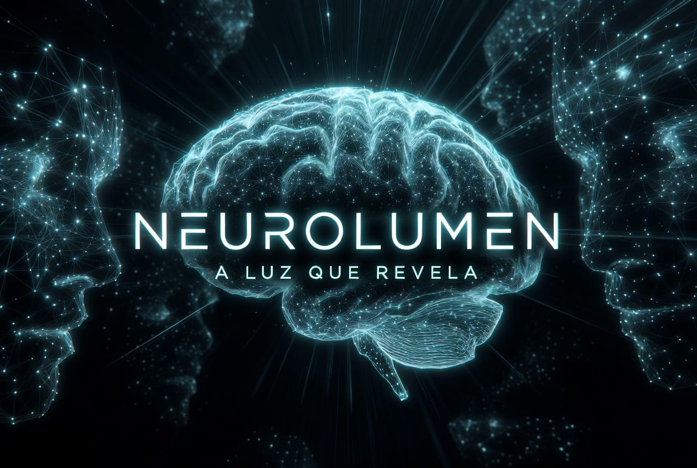
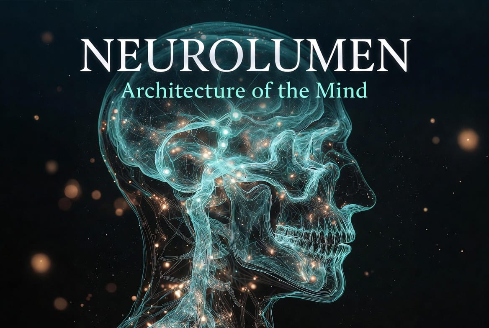

# NeuroLumen
**A Luz que Revela a Mão Humana**

> Plataforma Global de Decodificação Cognitiva da Produção Humana

**Estado:** 🟢 Iniciado  
**Versão atual:** `v0.3.0` — Build 0.3 Design System  
**Licença:** MIT

---

## O que é o NeuroLumen?

O NeuroLumen **não pretende “ler mentes”**.

Ele procura **reconstruir, por meio de Inteligência Artificial**, os processos criativos humanos registrados em obras, documentos, manuscritos, arquitetura, música, ciência e biografias.

Em vez de perguntar:
> *“O que Leonardo pensava?”*

A plataforma pergunta:
> *“Quais evidências históricas e padrões observáveis permitem construir hipóteses sobre seu processo criativo?”*

---

## Missão

Revelar como a inteligência humana deixa rastros em tudo o que cria.

---

## Identidade Visual Oficial

| Asset | Uso |
|-------|-----|
|  | **Logo / Banner principal** — identidade de marca |
|  | **AI Engine** — Processamento Multimodal Universal (50+ formatos) |
|  | **Impacto Neuroscience** — Architecture of the Mind |

Design System completo: [DESIGN_SYSTEM.md](./DESIGN_SYSTEM.md) · Tokens: [design/tokens.css](./design/tokens.css)

---

## Os Cinco Pilares

| Pilar | Descrição |
|-------|-----------|
| **1. Arte** | Análise de pinturas, esculturas, arquitetura, manuscritos e desenhos |
| **2. BioData** | “Mapa Histórico” de indivíduos |
| **3. Cognição** | Motor de hipóteses explicáveis |
| **4. Knowledge Graph** | Conhecimento conectado |
| **5. Luz Reveladora** | Algoritmo que indica o grau de evidência |

---

## Diferencial Científico

| Tipo | Descrição |
|------|-----------|
| **Fatos documentados** | Fontes históricas verificáveis |
| **Inferências** | Derivadas de modelos e evidências |
| **Hipóteses exploratórias** | Interpretações de baixa ou média confiança |
| **Conteúdo criativo** | Simulações e narrativas produzidas por IA |

---

## Status das Builds

| Build | Nome | Status |
|-------|------|--------|
| **0.1** | Alpha Foundation (Genesis) | ✅ Concluída |
| **0.2** | Architecture + Skeleton | ✅ Concluída |
| **0.3** | Design System completo | ✅ Concluída |
| **0.4** | HTML estruturado | 📋 Próxima |
| 0.5–1.0 | CSS → JS → React → Backend → IA → Publicação | 📋 Planejado |

---

## Princípios de Engenharia

1. Modularidade  
2. Transparência  
3. Escalabilidade  
4. Explicabilidade  
5. Preservação Cultural

---

## Documentação

- [MANIFESTO.md](./MANIFESTO.md)
- [VISION.md](./VISION.md)
- [ARCHITECTURE.md](./ARCHITECTURE.md)
- [DESIGN_SYSTEM.md](./DESIGN_SYSTEM.md)
- [ROADMAP.md](./ROADMAP.md)
- [CONTRIBUTING.md](./CONTRIBUTING.md)
- [CODE_STYLE.md](./CODE_STYLE.md)

---

**NeuroLumen** — A Luz que Revela a Mão Humana.  
*Build 0.3 — Design System completo*
